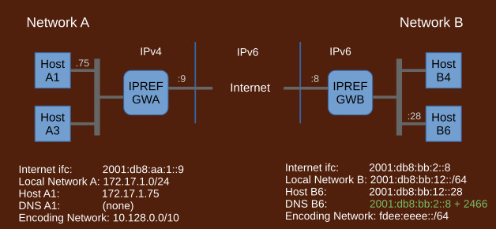

## How IPREF Works in Detail

IPREF is a method for traversing address spaces such as private networks behind NAT, NAT6, or cross protocol IPv4/IPv6 otherwise not possible through native means. The term IPREF is an abbreviation for IP Addressing with REFerences

#### Key Characteristics of IPREF

- massively scalable
- cross protocol, cross address space
- strictly layer 3 (no port manipulation, all ports available on all hosts)
- host addresses publishable in DNS
- supports any combination of IPv4/IPv6 local networks and IPv4/IPv6 Internet
- no need for external translators or shared configurations
- no need for any global addresses from any protocol domain, IPv4 or IPv6

#### Multiprotocol Internet

With wide deployment of IPREF, the Internet will evolve into a multiprotocol Internet. It is a natural next evolutionary step: from current single protocol, multiple address spaces Internet created by NAT to a multiprotocol, multiple address spaces Internet made possible by IPREF.

- no need to "transition" to IPv6 or to anything (keep your network)
- ubiquitous IPv4/IPv6 compatibility throughout the Internet
- eliminates NAT/NAT6/CGNAT
- eliminates dual stacks (pure IPv4 or pure IPv6)
- true peer-to-peer (automatic NAT traversal and protocol traversal)
- organic deployment (replaces nothing, conflicts with nothing)
- greatly simplified single public Internet (pure IPv6 or pure IPvNEXT)
- substantially lower costs and risks
- new wave of innovation in networking

### Fundamental Concepts

IPREF is based on the observation that the originating host does not need to know the destination address so long as that address can be referred to in a manner understood by both ends. Similarly, the destination host does not need to know the source address, again, so long as it can be referred to. Thus IPREF uses references to IP addresses instead of real addresses. This approach produces highly scalable, cross protocol, cross address space communication system without a need for any negotiations or shared configurations.

### IPREF Address

IPREF does not use real addresses. Instead, it uses references which are opaque integers. Such references need context to be meaningful, therefore IPREF uses addressing units, called IPREF addresses, comprised of a context address, which must be native, and a reference.

A context address for respective source and destination networks is an Internet address accessible to these networks. It could be the outer address of the edge router but it could be an address of internal host. Originating hosts send packets to the network with this address and have that network calculate the actual address of the destination based on the supplied reference.

References are allocated by admins of respective networks where they reside. Thus references to source addresses are allocated by source network admins while references to destination addresses are allocated by destination network admins.

References do not change as packets travel, the addresses they refer to do. Thus the references at the source refer to different addresses than the same references at the destination. There is never a conflict because the references are interpreted in the context of respective networks.

IPREF addresses are publishable in DNS. Client hosts may query, and obtain, addresses of servers through DNS. This is the most common way of distributing IPREF addresses although other methods may also be used.

### Packet Exchange

Conceptually, packet exchange is based exclusively on IPREF addresses. However, local networks run native protocols, IPv4 or IPv6, which do not understand IPREF addresses. The gateways encode IPREF addresses into native local addresses which can be used by local hosts. Encoded addresses come from a dedicated private address range, such as 10.128.0.0/10 or fdee:eeee::/64. The gateways replace these encoded addresses with corresponding IPREF addresses before sending packets out. On the way in, they replace incoming IPREF addresses with encoded local addresses before injecting packets to the local network.

Let's say an IPv4 host A1 wants to send a packet to an IPv6 host B6:
	
1. #### Host A1 finds out the address of host B6
	
	Host  A1 issues a DNS query for host B6. The query goes through  the local resolver.
		
	Local resolver receives a response:
		
		B6 has address: 2001:db8:bb:2::8 + 2466
		
	Since local hosts don't understand IPREF addresses, the resolver asks gateway GWA to allocate an encoded address for it. The gateway responds:
		
		map: 2001:db8:bb:2::8 + 2466  =  10.128.48.62
			
	The resolver returns the encoded result of the DNS query to host A1:
		
		B6 has address:  10.128.48.62
			
1. #### Host A1 sends a packet out to B6
	
	Host A1 places its own address as source and the address of host B6 returned by the local resolver as destination.
		
		packet out: | 172.17.1.75 | 10.128.48.62 | payload |
			
1. #### Packet arrives at gateway GWA
	
		packet in:  | 172.17.1.75 | 10.128.48.62 | payload |
			
	The gateway notices that it does not have a mapping for the source address, so it creates one on the fly:
		
		map: 172.17.1.75 = 2001:db8:aa:1::9 + 1579
			
	It replaces source address with the just created corresponding IPREF address. It replaces encoded destination address with the original IPREF address returned by the DNS query. It also repackages IPv4 packet into IPv6 since the Internet is IPv6.
		
		packet out: | 2001:db8:aa:1::9 + 1579 | 2001:db8:bb:2::8 + 2466 | payload |

1. #### Packet arrives at gateway GWB
	
		packet in:  | 2001:db8:aa:1::9 + 1579 | 2001:db8:bb:2::8 + 2466 | payload |
			
	The gateway notices that it does not have an encoding for the source IPREF address, so it creates one on the fly:
		
		map: 2001:db8:aa:1::9 + 1579 = fdee:eeee::1377:5951
			
	It replaces source IPREF address with the just created local encoded address. It replaces destination IPREF address with the local address of host B6
		
		packet out: | fdee:eeee::1377:5951 | 2001:db8:bb:12::28 | payload |
			
			
1. #### Packet arrives at host B6
	
		packet in:  | fdee:eeee::1377:5951 | 2001:db8:bb:12::28 | payload |
			
	Host B6 recognizes destination address as its own and consumes the packet. OS passes the packet to an application implied by layer 4.
		
1. #### Host B6 sends a reply back to A1
	
	Host B6 gets a reply payload from the application, swaps source and destination addresses, and sends the packet back to A1
		
		packet out: | 2001:db8:bb:12::28 | fdee:eeee::1377:5951 | payload |
			
1. #### Packet arrives at gateway GWB
	
		packet in:  | 2001:db8:bb:12::28 | fdee:eeee::1377:5951 | payload |
			
	The gateway replaces local source address with corresponding IPREF address previously allocated and advertised in DNS. It replaces destination local encoded address with the corresponding IPREF address from mapping created earlier.
		
		packet out: | 2001:db8:bb:2::8 + 2466 | 2001:db8:aa:1::9 + 1579 | payload |
			
1. #### Packet arrives at gateway GWA
	
		packet in:  | 2001:db8:bb:2::8 + 2466 | 2001:db8:aa:1::9 + 1579 | payload |
			
	The gateway replaces source IPREF address with the corresponding local encoded address from mapping created earlier. It replaces destination IPREF address with the local address of host A1. It also realizes that the local network is IPv4, so it repackages the packet into IPv4.
		
		packet out: | 10.128.48.62 | 172.17.1.75 | payload |
			
1. #### Packet arrives at host A1
	
		packet in:  | 10.128.48.62 | 172.17.1.75 | payload |
			
	Host A1 recognizes destination address as its own and consumes the packet. OS passes the packet to the application that sent the original packet.
		
At this point any missing mappings have been allocated. Subsequent packet exchange continues without additional allocations.

### IPREF with DNS

IPREF addresses are publishable in DNS. These addresses will most likely require a new RR type. Until a new record type is allocated, TXT records may be used. In the diagram above, an AA record is used for illustration purpose.
	
Local networks may publish IPREF addresses of their servers using standard authoritative DNS servers. All such published IPREF addresses must be communicated to the local IPREF gateway so that it can properly map destination addresses of incoming packets to local hosts. This is indicated in the diagram by a line connecting the DNS server and the IPREF gateway.
	
For resolution of DNS names, a modified recursive resolver, that recognizes IPREF addresses, is required. The resolver must be able to encode returned IPREF addresses into local private addresses in cooperation with local IPREF gateway. This is indicated in the diagram by a line connecting the resolver and the IPREF gateway. This is needed because local hosts do not understand IPREF addresses. Instead, local hosts use encoded equivalents which are then replaced with the actual IPREF addresses by the gateway.
