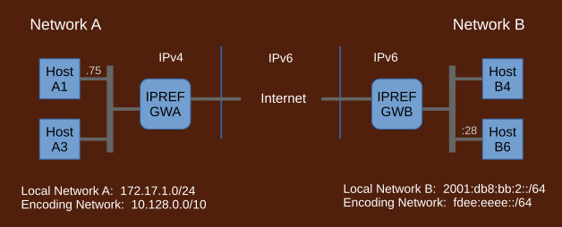
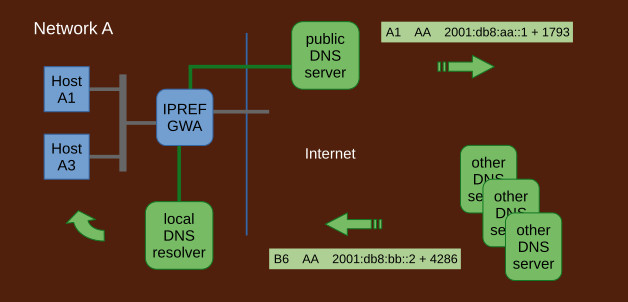

## How IPREF Works

IPv4 creep is a phenomenon where the efforts to transition the Internet to IPv6 unintentionally result in extending the life of the IPv4 Internet.

Traditional transition strategy involves dual stacks and a collection of translation devices such as NAT64/SIIT and xlat464. Dual stacks and the translators require IPv4 addresses. They are setup first, before transition takes place, and cannot be taken down until AFTER every single network transitions to IPv6. In realistic terms that will take decades to come about if ever.

A far better strategy is to use IPREF. IPREF does not use dual stacks and it does not use any translator devices that require IPv4 addresses. IPREF gateways are setup first which then make possible to drop IPv4 Internet very early in the process. The actual transition of the local networks to IPv6 takes place after IPv4 has been switched to IPv6. It may take however long it needs. It has no bearing on the Internet. In this way, IPv4 creep is eliminated.

1. ### IPREF Address

    

1. ### Packet exchange

    IPREF gateways are installed but not used.

	

	IPREF gateways are configured. References are assigned. Traffic goes through the IPREF gateways. 	All services subject to transition are now accessed via IPREF. Tests should be run to confirm this.

1. ### IPREF with DNS

	

	DNS
