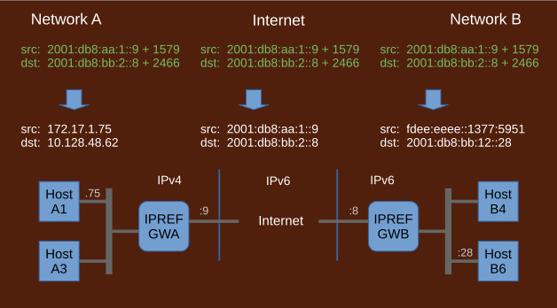

## IPREF Overview

IPREF is a method for communication across different address spaces, i.e.: address spaces that are not reachable by native network protocols. Examples are private networks behind NAT, NAT6, or filters, as well as networks employing different network protocols IPv4/IPv6. The term IPREF is an abbreviation for "IP Addressing with References"

Key characteristics of IPREF:

- massively scalable
- cross protocol, cross address space (such as NAT/NAT6)
- strictly layer 3 (no port manipulation, all ports available)
- addresses publishable in DNS
- no need for external translators or shared configurations
- no need for any global addresses IPv4 or IPv6

1. ### References

	An common problem with cross protocol communication is how to deal with addresses. Communicating peers do not understand each other's addresses therefore some other method of directing packets to proper destinations must be devised.

	IPREF solves this problem by using references to addresses instead of actual addresses. The references are then evaluated by each address space to render proper native addresses suitable for forwarding. Each address space performs the evaluation independently from other address spaces. As a result the same references render different addresses at different address spaces.

	
1. ### IPREF Addresses

    
    
    IPREF does not use real addresses. Instead, it uses references which are opaque integers. Such references need a context to be meaningful, therefore IPREF uses addressing units, called IPREF addresses, that are a combination of a native IP address and a reference.

    The native portion of an IPREF address is a native address within adjacent address space.  Typically, the adjacent address space is the Internet, so this is usually an Internet address of an edge router of the source or destination network. Such arrangement is a convenience, not a requirement, other addresses known to the network may also be used. Originating hosts send packets to the network with this address and have that network render the actual addresses for both source and destination based on the supplied references.

	References are allocated by admins managing respective address spaces. The references may only refer to hosts from local address space. There is no cross address space allocation. It can be described as: "I'm allocating mine, you're allocating yours, I'm taking yours as opaque values, you're taking mine as opaque values". There are no allocation conflicts because references are always evaluated in the context of each address space.
	
	IPREF addresses are publishable in DNS. Servers may advertise their IPREF addresses in DNS. Clients may query DNS for IPREF addresses of servers they want to reach.
	
1. ### Encoding Networks and Gateways

	IPREF addresses are placed in packets by gateways. The gateways must be installed at each address space participating in IPREF communication. Intermediate address spaces, such as the Internet, don't need gateways.
	
	The gateways inject and remove IPREF addresses as packets leave and enter local networks. They also encode IPREF addresses for internal use as local network protocols only understand native addresses. The encoding networks are local private networks to which the gateways map IPREF addresses. For example, IPv4 networks could use a 10/8 network while IPv6 networks could use an fd::/64 network. For local hosts, these encoded addresses represent peers they communicate with. The peers appear as if on the local network. This is a common consequence of cross protocol communication. The gateways replace these encoded addresses with IPREF addresses when sending outside local networks.

1. ### Traversing Address Spaces

	

	Conceptually, packets travel through address spaces based on source and destination IPREF addresses. This is analogous to IP protocols. The IPREF addresses are interpreted at each address space to render local native addresses for forwarding.
	
	For example, in the diagram above, if host A1 wanted to send a packet outside of its own address space to host B6, then it would need a source IPREF address for itself and a destination IPREF address for B6. 
	
	In the diagram, IPREF addresses are shown in green while native, local addresses are shown in white. The destination IPREF address of host B6, presumably a server, would be allocated by the admin of the network where B6 resides. It would normally be advertised in DNS. The source IPREF address of A1, presumably a client, would be allocated dynamically by the local IPREF gateway.
	
	As packets travel from source to destination, the following takes place
	
	* At network A, the IPREF source address is interpreted as a native address of host A1. The destination IPREF address is interpreted as some local private address on the encoding network. This allows host A1 to place native addresses in the packet. The IPREF gateway will replace both source and destination addresses with their IPREF equivalents. It will also repackage IPv4 packets into IPv6 since the next address space is IPv6.
	
	* In the transient address space, the Internet, IPREF addresses are interpreted by ignoring references and using only native portions. Transient networks, such as the Internet, are completely unaware of IPREF.
	
	* At network B, the IPREF source address is interpreted as some local private address on the encoding network. The IPREF destination address is interpreted as a native address of host B6. In this way, a packet originating at an IPv4 host A1 reaches an IPv6 host B6.
	
	On the way back, source and destination addresses are reversed and their interpretation follows the same pattern, thus a reply packet originating at an IPv6 host B6 reaches an IPv4 host A1.

	Each of the address spaces, in the example, may be IPv4 or IPv6 and the packets would traverse them the same way. With two protocols and three address spaces, there are eight possible configurations and they all work the same way. 