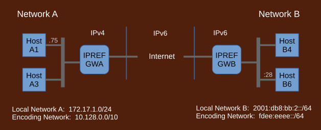

## How IPREF Works

IPREF is a method for traversing address spaces - such as private networks behind NAT, NAT6, or filters including cross protocol IPv4/IPv6 - which are otherwise not reachable through native network protocols. The term IPREF is an abbreviation for "IP Addressing with References"

Key characteristics of IPREF:

- massively scalable
- cross protocol, cross address space
- strictly layer 3 (no port manipulation, all ports available)
- host addresses publishable via DNS
- works the same way in any combination of IPv4/IPv6 local networks and IPv4/IPv6 Internet
- no need for external translators, shared configurations, or any negotiations
- does not consume any global addresses from any protocol domain, IPv4 or IPv6

1. ### Fundamental Concepts

	IPREF is based on an observation that the originating host does not need to know the destination address so long as that address can be referred to in a manner understood by both peers. Similarly, the destination host does not need to know the source address, again, so long as it can be referred to. This approach produces highly scalable, cross protocol, cross address space communication system that does not need any shared configuration or any negotiations.

1. ### IPREF Address

    
    
    IPREF does not use real addresses. Instead, it uses references which are opaque integers. Such references need a context to be meaningful, therefore IPREF uses addressing units, called IPREF addresses, that are a combination of a native IP address and a reference.

    Typically, the native portion of an IPREF address is an Internet address of an edge router of the source or destination network. It is a convenience, not a requirement, other addresses known to the network may also be used. Originating hosts send packets to the network with this address and have that network calculate the actual address of the destination based on the supplied reference.

    References are allocated by admins of respective networks where hosts reside. There is no negotiations involved since these references are interpreted in the context of respective networks.

1. ### Packet Exchange

	

	Conceptually, packet exchange is based exclusively on IPREF addresses. However, local networks run native protocols, IPv4 or IPv6, which do not understand IPREF addresses. The gateways encode IPREF addresses into native local addresses which can be used by local hosts. Encoded addresses come from a dedicated private address range, such as 10.128.0.0/10 or fdee:eeee::/64. The gateways replace these encoded addresses with corresponding IPREF addresses before sending packets out. On the way in, they replace incoming IPREF addresses with encoded local addresses before injecting packets to the local network.

	Let's say an IPv4 host A1 wants to send a packet to an IPv6 host B6:
	
	- Host B6 advertises its IPREF address via DNS.
	- Host A1 places its own IPv4 address as the source. It does not understand IPREF addresses, so it relies on the gateway to encode the destination IPREF address as a local IPv4 address from some private range dedicated for the purpose. It places that encoded IPv4 address as the destination and sends the packet out.
	- The packet arrives at gateway GWA where the encoded destination address is replaced with the original IPREF address acquired from DNS. The IPv4 source address does not have a mapping to any IPREF address so the gateway allocates one on-the-fly and places it in the packet. Additionally, the gateway realizes the Internet is IPv6, so it repackages the packet into IPv6 and sends it out.
	- The packet arrives at gateway GWB where the destination address is replaced with the actual IPv6 address of host B6. The source IPREF address does not have a mapping to a local IPv6 address from some private range so the gateway allocates one on-the-fly and places it as the source. It then sends the packet out.
	- The packet now reaches host B6 and it is consumed by an application implied by layer 4.

	The application may reply by sending a packet back:
	
	- Host B6 swaps source and destination addresses and sends the packet out.
	- The packet arrives at gateway GWB. Mappings to IPREF addresses already exist for both source and destination so the gateway places the corresponding IPREF addresses in the packet and sends it out.
	- The packet arrives at gateway GWA. The gateway realizes local network is IPv4 so it repackages the packet into IPv4. Mappings to local IPv4 addresses already exist for both source and destination IPREF addresses so the gateway replaces both with local addresses and sends the packet out.
	- The packet now reaches host A1 and is consumed by the application that sent the original packet.

1. ### IPREF with DNS

	

	IPREF addresses are publishable via DNS. These addresses will most likely require a new RR type. Until a new record type is allocated, TXT records may be used. In the diagram above, an AA record is used for illustration purpose.
	
	Local networks may publish IPREF addresses of their servers using standard authoritative DNS servers. All such published IPREF addresses must be communicated to the local IPREF gateway so that it can properly map destination addresses of incoming packets to local hosts.
	
	For resolution of DNS names, a modified recursive resolver, that recognizes IPREF addresses, is required. The resolver must be able to encode returned IPREF addresses into local private addresses in cooperation with local IPREF gateway. This is needed because local hosts do not understand IPREF addresses. Instead, local hosts use encoded equivalents which are then replaced with the actual IPREF addresses by the gateway.