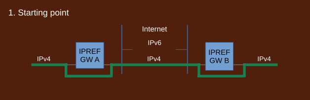
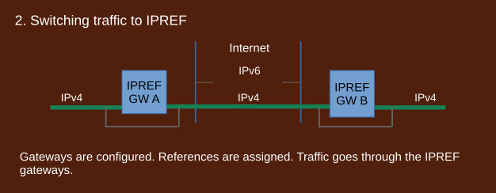
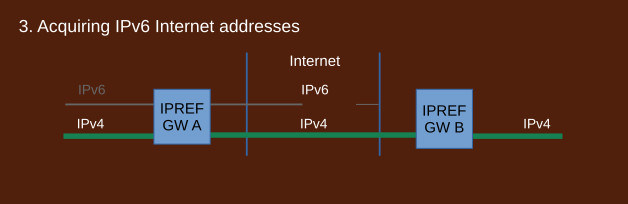
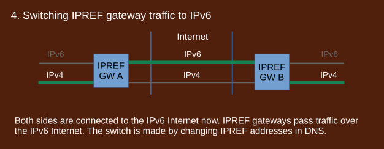
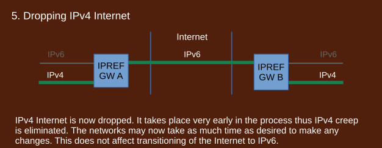
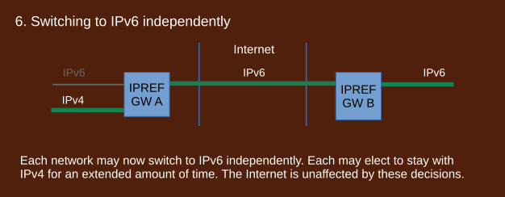
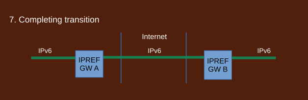

## How to stop IPv4 creep

IPv4 creep is a phonmenon

IPREF gateways are installed but not used yet.

IPREF gateways are configured. References are assigned. Traffic goes through the IPREF gateways.

Each side acquires IPv6 Internet addresses independently.

Both sides are connected to IPv6 Internet now. IPREF gateways pass traffic over the IPv6 Internet.

IPv4 Internet is now dropped. It takes place very early in the process thus IPv4 creep is eliminated. The upgrade of the local networks to IPv6 may take as much time as desired. This does not affect the Internet.

Each side may now switch to IPv6 independently. Each side may also elect to stay with IPv4 for an extended avount of time. The Internet is not affected by these decisions.

Transition is completed when both sides switch to IPv6. IPREF gateways remain in place to allow communication with third party sites that have not transitioned.