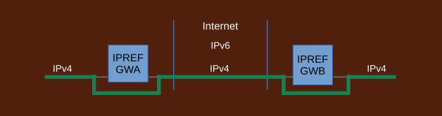
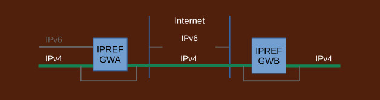
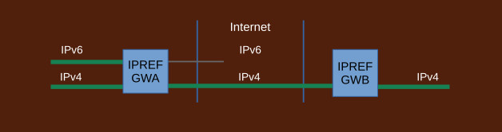
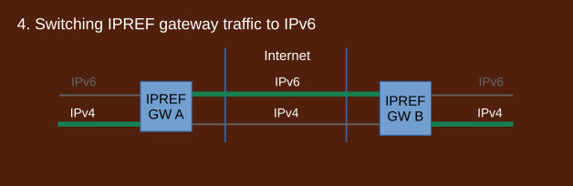
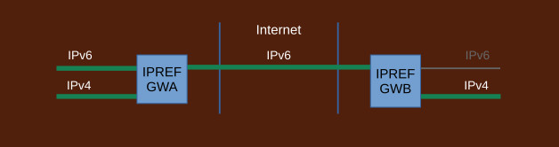
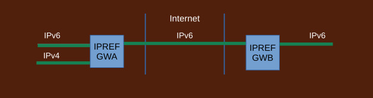
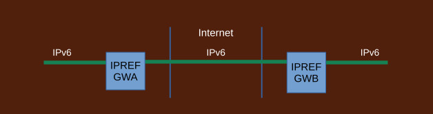

## Transition to IPv6 with IPREF

IPv4 creep is a phenomenon where the efforts to transition the Internet to IPv6 unintentionally result in extending the life of the IPv4 Internet.

Traditional transition strategy involves dual stacks and a collection of translation devices such as NAT64/SIIT and xlat464. Dual stacks and the translators require IPv4 addresses. They are setup first, before transition takes place, and cannot be taken down until AFTER every single network transitions to IPv6. In realistic terms that will take decades to come about if ever.

A far better strategy is to use IPREF. IPREF does not use dual stacks and it does not use any translator devices that require IPv4 addresses. IPREF gateways are setup first which then make possible to drop IPv4 Internet very early in the process. The actual transition of the local networks to IPv6 takes place after IPv4 has been switched to IPv6. It may take however long it needs. It has no bearing on the Internet. In this way, IPv4 creep is eliminated.

IPREF gateways are installed but not used.

IPREF gateways are configured. References are assigned. Traffic goes through the IPREF gateways. All services subject to transition are now accessed via IPREF. Tests should be run to confirm this.

Transition effort of local networks is decoupled from transition efforts of peer networks. Local networks may now start internal transition to IPv6 independently.

Each side acquires IPv6 Internet addresses independently.

Both sides are connected to IPv6 Internet now. IPREF gateways pass traffic over the IPv6 Internet. Tests should be run to confirm all services are now reachable via IPREF over the IPv6 Internet.

IPv4 Internet is now dropped. It takes place very early in the process thus IPv4 creep is eliminated. The upgrade of the local networks to IPv6 may take as much time as desired. This does not affect the Internet.

Each side may now switch to IPv6 independently. The switch is to pure IPv6, no dual stacks. Each side may also elect to stay with IPv4 for an extended amount of time. The Internet is not affected by these decisions.

Transition is completed when both sides switch to IPv6. IPREF gateways remain in place to allow communication with third party sites that have not transitioned.