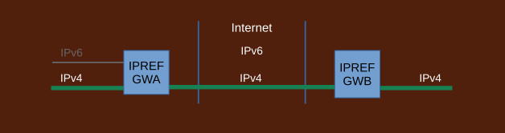

## Transition to IPv6 with IPREF

Transitioning to IPv6 Internet with IPREF offers significant benefits to both the transitioning organizations as well as to the Internet providers, carriers, and operators.

- massively scalable
- ability to drop IPv4 Internet early in the process
- transition to pure IPv6 (no dual stacks, no two step transition)
- no reliance on IPv4-as-a-service on any other IPv4 services from the Internet
- no global IPv4 addresses needed
- ability to transition at own pace
- huge cost savings

The ability to drop IPv4 Internet early dramatically speeds up adoption of IPv6 Internet. No reliance on any IPv4 services from the Internet leads to a great simplification of the IPv6 Internet.

The ability to transition at own pace results in huge reduction in costs and risks. Transition may proceed slowly, service by service, subnet by subnet, and it may involve leaving some services on IPv4 for an extended amount of time. The Internet is not affected.

Traditional transition strategy has a structural deficiency. It perpetuates IPv4 addressing. Thus it extends the life of IPv4 Internet endlessly, to the point it may be impossible to take it down. This is caused by the use of dual stacks and a collection of translation devices such as NAT64/SIIT/464XLAT. They all require IPv4 addresses. They are set up first, before transition takes place, and cannot be taken down until AFTER all networks out there transition to IPv6. In realistic terms it may take decades to happen if it ever does.

IPREF does not have such deficiency. It does not use dual stacks and it does not use any translator devices that rely on IPv4 addresses. IPREF gateways are set up first which makes it possible to drop IPv4 Internet very early. The actual transition of the local networks takes place after the Internet has been switched to IPv6. In this way, the life of the IPv4 Internet is never extended by the transitioning effort.

Transitioning process with IPREF takes advantage of IPREF's flexibility to operate in all combinations of IPv4/IPv6 configurations:

```
        network A   Internet   Network B

    1       IPv4      IPv4      IPv4        -- starting point
    2       IPv4      IPv4      IPv6           (possible but rare)
    3       IPv4      IPv6      IPv4        -- after dropping IPv4 Internet
    4       IPv4      IPv6      IPv6        -- common during transition
    5       IPv6      IPv4      IPv4           (same as 2)
    6       IPv6      IPv4      IPv6           (possible but rare)
    7       IPv6      IPv6      IPv4           (same as 4)
    8       IPv6      IPv6      IPv6        -- completed transition
```
This has the effect of making the transition process independent of what protocol the Internet runs, and what transition effort, if any, takes place at the peer networks. Generally, the process looks like this:

1. #### Starting point

	

	IPREF gateways are installed but not used.
	
1. #### Switching traffic to IPREF

	

	IPREF gateways are configured. References are assigned. Traffic goes through the IPREF gateways. All services subject to transition are now accessed via IPREF. Tests should be run to confirm that.

	Transition process at local networks is decoupled from transition efforts at any peer networks.
Local networks may now start internal transition to IPv6 independently. Traffic between the
gateways will remain over IPv4 Internet until both sides connect their IPREF gateways to IPv6. This does not affect transitioning of internal networks to IPv6.

1. #### Connecting to IPv6 Internet

	

	Each side connects to IPv6 Internet at their own pace. First pure IPv6 subnets may start appearing. Connectivity between internal IPv4/IPv4 networks is provided by the same IPREF gateway.
	
1. #### Switching IPREF gateway traffic to IPv6

	

	When both sides connect to IPv6 Internet, IPREF gateways may switch to passing traffic over the IPv6 Internet. Tests should be run to confirm all services are still reachable via IPREF.
	
1. #### Dropping IPv4 Internet

	

	IPv4 Internet may now be dropped. It takes place very early in the process. From the Internet's point of view, the transition of these sites to IPv6 has been completed. The Internet does not have to wait until every local network transitions to IPv6. Local networks may run any protocol they wish so long as they connect to the IPv6 Internet.

	From local networks' point of view, the transition to IPv6 might not even started but this has no bearing on the Internet. Local networks are free to take as much time as they need for the transition.
	
1. #### Switching to IPv6 independently

	

	Each side switches to IPv6 independently. The switch is to pure IPv6, no dual stacks. Each side may also elect to stay with IPv4 for an extended amount of time. The Internet is not affected.
	
1. #### Completing transition

	

	Transition is completed when both sides switch all internal networks to IPv6. IPREF gateways remain in place to allow communication with third party sites that have not transitioned.