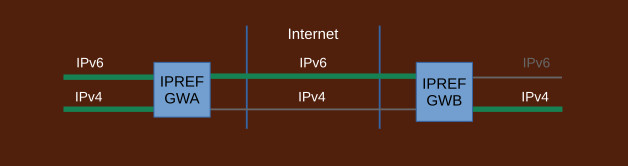

## Transition to IPv6 with IPREF

Transitioning to IPv6 Internet with IPREF offers significant benefits to both the transitioning organizations as well as to the Internet providers, carriers, and operators.

- needs only pure IPv6 Internet (no need for IPv4 services, or translators)
- transition to pure IPv6 networks (no dual stacks, not two-step transition)
- no need for global IPv4 addresses
- eliminates NAT/NAT6 (no need for port manipulation)
- plays nicely with DNSSEC
- allows to drop IPv4 Internet early in the process
- allows to transition at own pace
- massively scalable
- dramatically speeds up adoption of IPv6 Internet
- huge cost savings

The ability to drop IPv4 Internet early is the key to speeding up adoption of IPv6 Internet.

Relying on only pure IPv6 Internet and transitioning to pure IPv6 greatly simplifies network designs and operations. Transition based on IPREF produces far cleaner, simpler networks and a cleaner, simpler Internet.

The ability to transition at own pace, service by service, subnet by subnet results in huge reduction in costs and risks.

Traditional transition strategies have a structural deficiency. They perpetuate IPv4 addressing. Thus they extend the life of IPv4 Internet endlessly, to the point it may not be possible to take it down. This is caused by the use of dual stacks and a collection of translation devices such as NAT64/SIIT/464XLAT which all require allocation of IPv4 addresses. They are set up first, before transition takes place, and cannot be taken down until AFTER all networks out there transition to IPv6. This may take decades to happen if ever.

IPREF does not have such deficiencies. It does not use dual stacks and it does not use any translator devices that rely on IPv4 addresses. IPREF gateways are set up first which makes it possible to drop IPv4 Internet very early. The actual transition of the local networks takes place after the Internet has been switched to IPv6. In this way, the life of the IPv4 Internet is never extended by the transitioning effort.

### Transitioning Process

Transitioning process with IPREF takes advantage of IPREF's flexibility to operate in all combinations of IPv4/IPv6 configurations:

```
        network A   Internet   Network B

    1       IPv4      IPv4      IPv4        -- starting point
    2       IPv4      IPv4      IPv6           (possible but rare)
    3       IPv4      IPv6      IPv4        -- after dropping IPv4 Internet
    4       IPv4      IPv6      IPv6        -- common during transition
    5       IPv6      IPv4      IPv4           (same as 2)
    6       IPv6      IPv4      IPv6           (possible but rare)
    7       IPv6      IPv6      IPv4           (same as 4)
    8       IPv6      IPv6      IPv6        -- completed transition
```
Because different address spaces - network A, Internet, and network B - are processed independently by IPREF, it effectively decouples transitioning process at local networks from transitioning efforts at peer networks. It also decouples the process from the Internet protocol thus allowing dropping of IPv4 Internet early.

1. #### Starting point

	

	IPREF gateways are installed but not used. All connectivity is pure IPv4.
	
1. #### Switching traffic to IPREF

	

	IPREF gateways are configured. References are assigned. Traffic goes through the gateways. All services subject to transition are now accessed via IPREF. Some local IPv6 subnets may be set up but remain unused.

	Transition process at local networks is now decoupled from transition efforts at peer networks. Local networks may now start internal transition to IPv6 independently. Traffic between the gateways will remain over IPv4 Internet. This does not affect transitioning of internal networks to IPv6.

1. #### Connecting to IPv6 Internet

	

	Each side connects to IPv6 Internet at their own pace. First pure IPv6 subnets may start to appear. Clients on those subnets can reach servers located on local IPv4 networks and on peer networks (IPv4 or IPv6) over the same IPREF gateway.	 Similarly, servers on the IPv6 subnets can be reached from local IPv4 networks and peer networks over the same IPREF gateway.
	
1. #### Switching IPREF gateway traffic to IPv6

	

	After both ends connect to IPv6 Internet, IPREF gateways may switch to passing traffic over the IPv6 Internet. Transition process at local networks is not affected by this change.
	
1. #### Dropping IPv4 Internet

	

	IPv4 Internet may now be dropped. It takes place early in the process. From the Internet's point of view, transition IPv6 has been completed. The Internet does not have to wait until every local network transitions to IPv6. As sites keep dropping their IPv4 Internet connections, the entire IPv4 Internet may be taken down well before every network out there in the world completes their transitions. This is possible because IPREF does not rely on IPv4 addresses and because it decouples transitioning at local networks from the Internet.
	
	From local networks' point of view, the disappearance of IPv4 Internet is invisible. It does not affect the transitioning process.
	
1. #### Switching to IPv6 independently

	

	Each local network switches to IPv6 independently. It does so at its own pace and may involve keeping a mix of IPv4/IPv6 subnets if necessary or convenient. This does not affect transitioning effort at peer networks.
	
	
1. #### Completing transition

	

	Transition is completed when each side switches all internal networks to IPv6. All local networks are pure IPv6. The Internet is also pure IPv6. IPREF gateways may remain in place to allow communication with third party sites that have not transitioned.